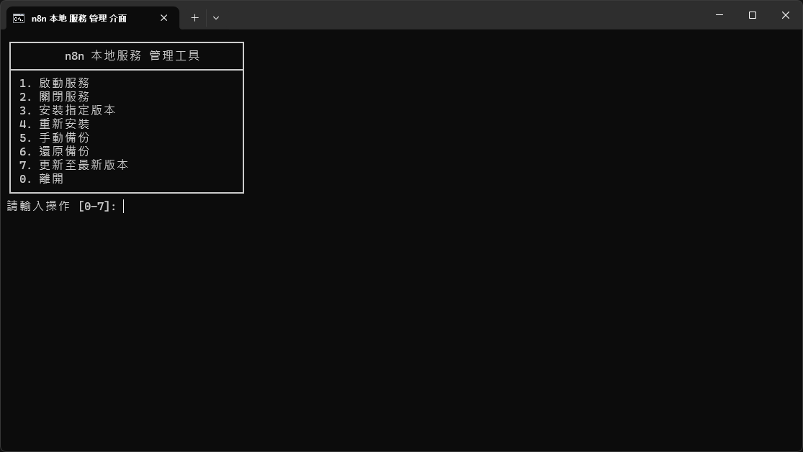

# n8n-launcher

一個跨平台的 n8n Docker 容器管理工具，支援 **Windows** 和 **macOS** 系統，提供簡單易用的選單介面來管理 n8n 工作流程自動化平台。

## 實際界面


## 功能特色

- 🚀 **一鍵啟動**：自動檢查並啟動 Docker，無需手動配置
- 📦 **自動配置**：首次使用時自動建立 `docker-compose.yml` 配置檔
- 🔄 **版本管理**：支援更新到指定版本或最新版本
- 💾 **資料備份**：一鍵備份 n8n 工作流程和資料庫
- 🔙 **資料還原**：輕鬆還原先前備份的資料
- 🛠️ **重新安裝**：快速重新安裝並可選擇保留資料

## 系統需求

### Windows 版本
- Windows 10/11
- Docker Desktop（腳本會自動檢查並提示安裝）
- 網路連線（用於下載 Docker 映像檔）

### Mac 版本
- macOS 10.15 或更新版本
- Docker Desktop（腳本會自動檢查並提示安裝）
- 網路連線（用於下載 Docker 映像檔）
- 自動支援 Intel 和 Apple Silicon (M1/M2/M3) 晶片

## 安裝與使用

### 首次使用前：設定環境變數

首次使用前，您需要設定以下必要的環境變數。建議在工作目錄中建立 `.env` 檔案：

#### Windows 工作目錄：`%USERPROFILE%\n8n`
#### Mac 工作目錄：`$HOME/n8n`

在對應的工作目錄中建立 `.env` 檔案，內容如下：

```env
# PostgreSQL 資料庫密碼（必填）
POSTGRES_PASSWORD=your_strong_database_password

# n8n 加密金鑰（必填，建議至少 32 字元）
N8N_ENCRYPTION_KEY=your_32_character_encryption_key_here

# 可選：PostgreSQL 使用者名稱（預設：n8n）
# POSTGRES_USER=n8n

# 可選：PostgreSQL 資料庫名稱（預設：n8n）
# POSTGRES_DB=n8n

# 可選：PostgreSQL 連接埠（預設：5432）
# POSTGRES_PORT=5432

# 可選：n8n 連接埠（預設：5678）
# N8N_PORT=5678
```

> 💡 **提示**：Docker Compose 會自動讀取 `.env` 檔案中的環境變數。
### Windows
下載並雙擊打開 `n8n.bat` 即可開始使用。

### Mac
1. 下載 `n8n.sh`
2. 開啟終端機（Terminal）
3. 給予執行權限：
   ```bash
   chmod +x n8n.sh
   ```
4. 執行腳本：
   ```bash
   ./n8n.sh
   ```

### 功能說明

#### 1. 啟動服務
- 檢查 Docker 是否運行
- 檢查 n8n 服務狀態
- 如果未運行，自動啟動 Docker Compose 服務
- 等待服務就緒後自動開啟瀏覽器

#### 2. 停止服務
- 停止所有 n8n 相關的 Docker 容器

#### 3. 更新到指定版本
- 輸入指定的版本號（格式：x.x.x，例如：2.2.3）
- 自動更新 `docker-compose.yml` 中的映像版本
- 下載新版本並重新啟動服務

#### 4. 重新安裝
- 完全移除現有的容器和資料卷
- 可選擇是否先備份資料
- 重新建立乾淨的安裝環境

#### 5. 備份資料
- 備份 n8n 工作流程資料
- 備份 PostgreSQL 資料庫
- 備份檔案儲存在工作目錄下的 `backup_YYYYMMDD-HHMMSS` 資料夾

#### 6. 還原資料
- 從先前備份的資料夾還原資料
- 需要輸入備份資料夾名稱（例如：`backup_20240101-120000`）

#### 7. 更新到最新版本
- 自動下載並更新到 n8n 的最新版本
- 重新啟動服務以套用更新

#### 0. 退出
- 停止所有服務並退出程式

## 預設配置

腳本會在工作目錄中建立以下配置：

- **工作目錄**：
  - Windows：`%USERPROFILE%\n8n`
  - Mac：`$HOME/n8n`
- **n8n 服務**：`http://localhost:5678`
- **PostgreSQL 資料庫**：`localhost:5432`（預設埠號）
- **使用者管理**：首次啟動時需註冊 Owner 帳號
- **時區**：`Asia/Taipei`

> 🔒 **安全提醒**：請務必設定強密碼的環境變數。

## 工作目錄結構

### Windows
```
%USERPROFILE%\n8n\
├── .env                    # 環境變數設定檔（需自行建立）
├── docker-compose.yml      # Docker Compose 配置檔（自動生成）
└── backup_YYYYMMDD-HHMMSS\ # 備份資料夾
    ├── n8n_data.tar.gz
    └── n8n_postgres_data.tar.gz
```

### Mac
```
~/n8n/
├── .env                    # 環境變數設定檔（需自行建立）
├── docker-compose.yml      # Docker Compose 配置檔（自動生成）
└── backup_YYYYMMDD-HHMMSS/ # 備份資料夾
    ├── n8n_data.tar.gz
    └── n8n_postgres_data.tar.gz
```

> 📝 **注意**：`.env` 檔案包含敏感資訊，請勿提交到版本控制系統。建議將 `.env` 加入 `.gitignore`。

## 常見問題

### Windows 相關

#### Q: Docker Desktop 無法啟動怎麼辦？
A: 請確認：
- Docker Desktop 已正確安裝
- 系統已啟用虛擬化功能（Hyper-V 或 WSL2）
- 以系統管理員權限執行

#### Q: 如何修改預設配置？
A: 可以編輯 `%USERPROFILE%\n8n\docker-compose.yml` 檔案，或修改 `n8n.bat` 中的環境變數設定。

#### Q: 備份檔案儲存在哪裡？
A: 備份檔案儲存在工作目錄（`%USERPROFILE%\n8n`）下的 `backup_YYYYMMDD-HHMMSS` 資料夾中。

### Mac 相關

#### Q: 終端顯示 "Permission denied" 錯誤？
A: 請先給予腳本執行權限：
```bash
chmod +x n8n.sh
```

#### Q: 終端顯示彩色代碼而不是彩色文字？
A: 請確認使用的是 bash shell。可以在腳本開頭加上 `#!/bin/bash` 確保使用正確的 shell。

#### Q: 如何修改預設配置？
A: 可以編輯 `~/n8n/docker-compose.yml` 檔案，或修改 `n8n.sh` 中的環境變數設定。

#### Q: 備份檔案儲存在哪裡？
A: 備份檔案儲存在工作目錄（`~/n8n`）下的 `backup_YYYYMMDD-HHMMSS` 資料夾中。

#### Q: Apple Silicon (M1/M2/M3) 可以使用嗎？
A: 完全支援！腳本會自動檢測晶片架構並下載對應版本的 Docker Desktop。

### 通用問題

#### Q: 服務啟動後無法訪問？
A: 請檢查：
- Docker Desktop 是否正在運行
- 埠號 5678 是否被其他程式佔用
- 防火牆設定是否允許存取

#### Q: 兩個系統的配置檔案相容嗎？
A: 是的！`docker-compose.yml` 在 Windows 和 Mac 上完全相同，可以直接複製使用。

## 授權

本專案採用 MIT 授權條款。

## 貢獻

歡迎提交 Issue 或 Pull Request！

## 相關連結

- [n8n 官方網站](https://n8n.io/)
- [n8n 文件](https://docs.n8n.io/)
- [Docker Desktop](https://www.docker.com/products/docker-desktop/)